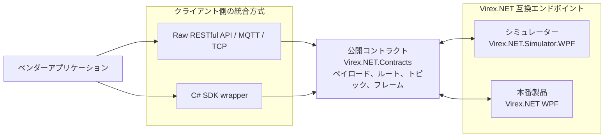

# 統合モデル

このリポジトリは、Virex.NET 互換エンドポイントの公開統合インターフェイスを定義します。統合クライアントが統合モデルを変更せずにエンドポイントを切り替えることができるように、シミュレーターと製品は同じコントラクトを公開する必要があります。

## 想定アーキテクチャ

SDK はオプションです。ベンダーは、Raw RESTful API/MQTT/TCP 統合または `Virex.NET.Client` を使用できますが、どちらの方法も同じ公開コントラクトに準拠する必要があります。

開発中、ベンダーは通常、シミュレーターに接続します。導入時に、ベンダーは本番製品のエンドポイントに接続します。エンドポイントは変更されますが、コントラクトとトランスポートの動作は変更されるべきではありません。

## 構成要素の役割

|パッケージまたはアプリケーション |役割 |
| --- | --- |
| `Virex.NET.Contracts` |公開 C# データモデル、RESTful API ルート定数、MQTT トピック名、TCP/NDJSON パーサー、およびイベントフォーマット用ヘルパーを提供します。 |
| `Virex.NET.Client` |厳密に型指定されたヘルパー API を必要とするベンダー向けのオプションの C# SDK ラッパー。統合境界そのものではありません。 |
| `Virex.NET.Simulator.Core` |シミュレーター固有のステート マシンとセッションの実装。本番サービスは、このシミュレーター コアに依存するのではなく、公開コントラクトを共有する必要があります。 |
| `Virex.NET.Simulator.WPF` |外部から観察可能な状態遷移とイベント動作をシミュレートするために使用されるローカル エンドポイント。 |
|本番 Virex.NET 製品 |シミュレーターと同じ公開 コントラクトを実装する必要がある本番エンドポイント。 |

`Virex.NET.Contracts` は公開契約の境界です。シミュレーターのみの概念や非公開の運用実装の詳細を含めてはいけません。

## 通信方式の責任

|通信方式 |方向 |責任 |
| --- | --- | --- |
| RESTful API |クライアントからサービスへ |状態、ProductInfo、システムのライフサイクル、実行、結果リストのコマンドとクエリ。 |
| TCP / NDJSON |双方向 |コマンドフレームとイベントフレームのソケットの直接統合。 |
| MQTT |サービスからクライアントへ |送信イベント通知のみ。 MQTT はコマンドには使用されません。 |

## 移植性の目標

ベンダー統合は、次の条件を満たす場合にのみ、シミュレーターから本番エンドポイントに移植可能です。

- `ProductInfo`、`SystemStatus.State`、コマンド応答、イベント、および結果の概要に関する公開コントラクトに従います。
- エンドポイント契約を変更せずに、Raw 通信呼び出しまたはオプションの C# SDK を使用できます。
- シミュレーター UI の詳細には依存しません。
- シミュレーターから本番環境への切り替えには、エンドポイントと認証構成の変更のみが必要です。
- `invalid_state` コマンド応答を通常のプロトコル動作として扱います。
- シミュレーターの固定遅延に依存するのではなく、イベントまたは結果クエリを通じて実行の完了を監視します。

## 公開境界

この統合キットには以下が含まれます。

- 通信データモデルとプロトコル定数。
- RESTful API、MQTT、TCP/NDJSON データのフォーマットおよび解析ツール。
- C# SDK ラッパー層。
- 外部から見える Virex.NET の状態遷移を再現するシミュレーターの動作。
- 例とドキュメント。

非公開検査アルゴリズム、カメラの内部、レシピの内部、ストレージの内部、顧客の資格情報、内部ホスト名、本番環境のパスを含めることはできません。
