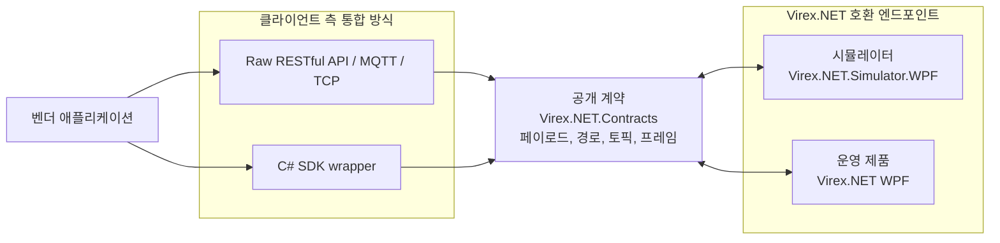

# 통합 모델

이 저장소는 Virex.NET 호환 엔드포인트에 대한 공개 통합 인터페이스를 정의합니다. 통합 클라이언트가 통합 모델을 변경하지 않고 엔드포인트를 전환할 수 있도록 시뮬레이터와 운영 제품은 동일한 계약을 노출해야 합니다.

## 예상 아키텍처

SDK는 선택 사항입니다. 벤더는 원시 RESTful API/MQTT/TCP 통합 또는 `Virex.NET.Client`를 사용할 수 있지만 두 방식 모두 동일한 공개 계약을 준수해야 합니다.

개발 중에 벤더는 일반적으로 시뮬레이터에 연결합니다. 배포 시 벤더는 운영 제품 엔드포인트에 연결됩니다. 엔드포인트는 변경되지만 계약 및 통신 동작은 변경되어서는 안 됩니다.

## 제품군 역할

| 패키지 또는 애플리케이션 | 역할 |
| --- | --- |
| `Virex.NET.Contracts` | 공개 C# 데이터 모델, RESTful API 경로 상수, MQTT 토픽 이름, TCP/NDJSON 파서 및 이벤트 형식 지정 도우미를 제공합니다. |
| `Virex.NET.Client` | 엄격한 타입의 도우미 API를 원하는 벤더를 위한 선택적 C# SDK 래퍼입니다. 통합 경계가 아닙니다. |
| `Virex.NET.Simulator.Core` | 시뮬레이터별 상태 머신 및 세션 구현. 운영 서비스는 이 시뮬레이터 코어에 의존하지 않고 공개 계약을 공유해야 합니다. |
| `Virex.NET.Simulator.WPF` | 외부에서 관찰 가능한 상태 전환 및 이벤트 동작을 시뮬레이션하는 데 사용되는 로컬 엔드포인트입니다. |
| 운영 Virex.NET 제품 | 시뮬레이터와 동일한 공개 계약을 구현해야 하는 운영 엔드포인트입니다. |

`Virex.NET.Contracts`는 공개 계약 경계입니다. 여기에는 시뮬레이터 전용 개념이나 비공개 운영 환경 구현 세부정보가 포함되어서는 안 됩니다.

## 통신 방식 책임

| 통신 방식 | 방향 | 책임 |
| --- | --- | --- |
| RESTful API | 클라이언트에서 서비스로 | 상태, ProductInfo, 시스템 수명 주기, 실행 및 결과 목록에 대한 명령 및 쿼리입니다. |
| TCP / NDJSON | 양방향 | 명령 프레임, 쿼리 프레임, 직접 응답 및 이벤트 프레임에 대한 직접 소켓 통합. |
| MQTT | 양방향 | 서비스에서 클라이언트로의 이벤트 알림과 함께 `commands/...` topic의 명령/쿼리 요청 및 `responses/{correlationId}` topic의 연결 응답을 지원합니다. |

## 이식성 목표

벤더 통합은 다음 조건을 충족하는 경우에만 시뮬레이터에서 운영 엔드포인트로 이식 가능합니다.

- `ProductInfo`, `SystemStatus.State`, 명령 응답, 이벤트 및 결과 요약에 대한 공개 계약을 따릅니다.
- 엔드포인트 계약을 변경하지 않고 Raw 통신 호출 또는 선택적 C# SDK를 사용할 수 있습니다.
- 시뮬레이터 UI 세부정보에 의존하지 않습니다.
- 시뮬레이터에서 운영 환경으로 전환하려면 엔드포인트 및 인증 구성 변경만 필요합니다.
- `invalid_state` 명령 응답을 일반적인 프로토콜 동작으로 처리합니다.
- 고정된 시뮬레이터 지연에 의존하는 대신 이벤트 또는 결과 쿼리를 통해 실행 완료를 관찰합니다.

## 공개 경계

이 통합 키트에는 다음이 포함될 수 있습니다.

- 통신 데이터 모델 및 프로토콜 상수.
- RESTful API, MQTT, TCP/NDJSON 데이터 형식 지정 및 구문 분석 도구.
- C# SDK 래퍼 레이어.
- 외부에서 볼 수 있는 Virex.NET 상태 전환을 재현하는 시뮬레이터 동작.
- 예제 및 문서.

비공개 검사 알고리즘, 카메라 내부, 레시피 내부, 스토리지 내부, 고객 자격 증명, 내부 호스트 이름 또는 운영 환경 경로를 포함해서는 안 됩니다.
