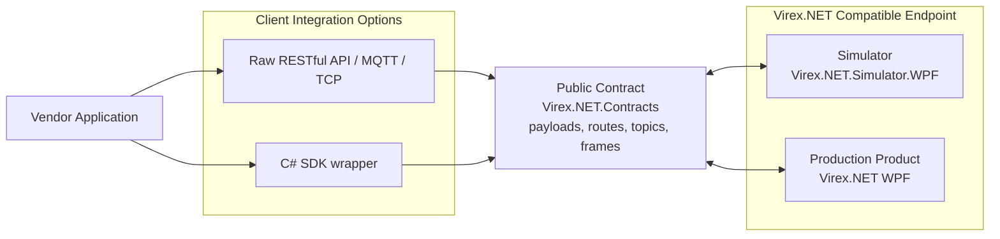

# Integration Model

This repository defines the public integration interface for Virex.NET compatible endpoints. The simulator and the production product should expose the same contract so that an integration client can switch endpoints without changing its integration model.

## Expected architecture

The SDK is optional. Vendors can use raw RESTful API/MQTT/TCP integration or `Virex.NET.Client`, but both methods must comply with the same public contract.

During development, vendors usually connect to the simulator. When deploying, the vendor connects to the production product endpoint. The endpoint changes, but the contract and transport behavior should not.

## Suite roles

| Package or application | Role |
| --- | --- |
| `Virex.NET.Contracts` | Provides public C# data models, RESTful API route constants, MQTT topic names, TCP/NDJSON parsers, and event formatting helpers. |
| `Virex.NET.Client` | Optional C# SDK wrapper for vendors who want strongly typed helper APIs. It is not the integration boundary. |
| `Virex.NET.Simulator.Core` | Simulator-specific state machine and session implementation. Production services should share the public contract, not depend on this simulator core. |
| `Virex.NET.Simulator.WPF` | Local endpoint used to simulate externally observable state transitions and event behavior. |
| Production Virex.NET Product | Production endpoint that should implement the same public contract as the simulator. |

`Virex.NET.Contracts` is the public contract boundary. It should not contain simulator-only concepts or private production implementation details.

## Transport Responsibilities

| Transport | Direction | Responsibility |
| --- | --- | --- |
| RESTful API | Client to service | Commands and queries for state, ProductInfo, system lifecycle, runs, and result lists. |
| TCP / NDJSON | Bidirectional | Direct socket integration for command frames, query frames, direct responses, and event frames. |
| MQTT | Bidirectional | Event notifications from service to clients, plus correlated command/query requests and responses through `commands/...` and `responses/{correlationId}` topics. |

## Portability Target

Vendor integrations are portable from the simulator to the production endpoint only when they meet these conditions:

- They follow the public contract for `ProductInfo`, `SystemStatus.State`, command responses, events, and result summaries.
- They can use raw transport calls or the optional C# SDK without changing the endpoint contract.
- They do not rely on simulator UI details.
- Switching from the simulator to production only requires endpoint and authentication configuration changes.
- Treat `invalid_state` command responses as normal protocol behavior.
- Observe run completion through events or result queries instead of relying on fixed simulator delays.

## Public boundaries

This integration kit can include:

- Communication data models and protocol constants.
- RESTful API, MQTT, TCP/NDJSON data formatting and parsing tools.
- C# SDK wrapper layer.
- Simulator behavior that reproduces externally visible Virex.NET state transitions.
- Examples and documentation.

It should not contain private inspection algorithms, camera internals, recipe internals, storage internals, customer credentials, internal hostnames, or production environment paths.
