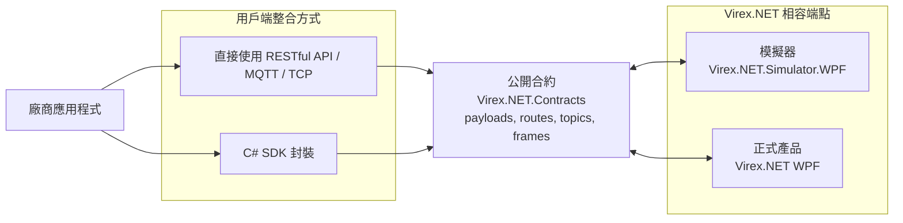

# 整合模型

這個儲存庫定義 Virex.NET 相容端點的公開整合介面。模擬器與正式產品應公開同一份合約，讓整合用戶端可以在不改變整合模型的前提下切換端點。

## 預期架構

SDK 是選用工具。廠商可以直接使用 RESTful API/MQTT/TCP 整合，也可以使用 `Virex.NET.Client`，但兩種方式都必須遵守同一份公開合約。

開發時，廠商通常連到模擬器。部署時，廠商連到正式產品端點。端點會改變，但合約與傳輸行為不應該改變。

## 套件角色

| 套件或應用程式 | 角色 |
| --- | --- |
| `Virex.NET.Contracts` | 以 C# 模型提供共用公開資料模型、RESTful API 路由常數、MQTT 主題名稱、TCP/NDJSON 解析器與事件格式化工具。 |
| `Virex.NET.Client` | 選用的 C# SDK 封裝，供需要強型別輔助 API 的廠商使用。它本身不是整合邊界。 |
| `Virex.NET.Simulator.Core` | 模擬器專用的狀態機與工作階段實作。正式服務應共用公開合約，不應依賴這個模擬器核心。 |
| `Virex.NET.Simulator.WPF` | 本機端點，用來模擬外部可觀察到的狀態轉移與事件行為。 |
| 正式 Virex.NET 產品 | 正式端點，應該實作與模擬器相同的公開合約。 |

`Virex.NET.Contracts` 是公開合約邊界，不應包含模擬器專用或正式產品私有實作概念。

## 傳輸分工

| 傳輸方式 | 方向 | 職責 |
| --- | --- | --- |
| RESTful API | 用戶端到服務 | 命令與查詢：狀態、ProductInfo、系統生命週期、執行、結果清單。 |
| TCP / NDJSON | 雙向 | 直接 socket 整合，用於命令資料框與事件資料框。 |
| MQTT | 服務到用戶端 | 只做傳出事件通知。MQTT 不用於命令。 |

## 可攜目標

廠商整合符合以下條件時，才算可從模擬器切到正式端點：

- 遵守公開合約中的 `ProductInfo`、`SystemStatus.State`、命令回應、事件與結果摘要。
- 可以直接呼叫傳輸層 API，或選用 C# SDK；兩者都不應改變端點合約。
- 不依賴模擬器 UI 細節。
- 從模擬器切到正式環境時，只需要修改端點與認證資訊。
- 將 `invalid_state` 命令回應視為正常通訊協定行為。
- 透過事件或結果查詢觀察執行完成，而不是依賴固定的模擬器延遲。

## 公開邊界

這個整合套件可以包含：

- 通訊資料模型與通訊協定常數。
- RESTful API、MQTT、TCP/NDJSON 資料格式化與解析工具。
- C# SDK 包裝層。
- 模擬外部可見 Virex.NET 狀態轉移的模擬器行為。
- 範例與文件。

不應包含私有檢測演算法、相機內部邏輯、recipe 內部邏輯、儲存內部邏輯、客戶認證資訊、內部主機名稱或正式環境專用路徑。
