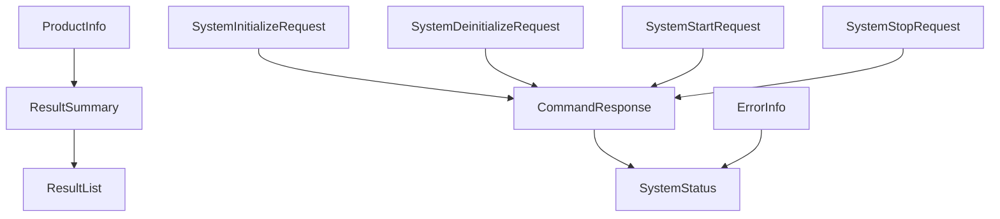

# ペイロード参照

このセクションでは、公開 Virex.NET 統合インターフェイスで使用される JSON ペイロード モデルを定義します。

各モデルには独自のページがあります。ベンダーは、`Virex.NET.Contracts` で C# タイプを使用することも、独自の言語で同等のモデルを定義することもできます。統合コントラクトは、C# タイプ自体ではなく、JSON の構造と動作です。

## JSON ルール

|ルール |動作 |
| --- | --- |
|プロパティ名 | `camelCase` を使用します。 |
| Null 値 |シリアライズ時は省略します。 |
|受信プロパティ名 |大文字と小文字は区別されません。 |
|テキストエンコーディング | UTF-8 JSON。 |

## モデルグループ

|グループ |モデル |目的 |
| --- | --- | --- |
|システム | [SystemStatus](payloads/system/system-status.ja.md)、[ErrorInfo](payloads/system/error-info.ja.md) |現在のシステム状態とアクティブなエラー情報。 |
|製品 | [ProductInfo](payloads/product/product-info.ja.md) |実行と結果に関連する製品情報。 |
|コマンド | [CommandResponse](payloads/commands/command-response.ja.md)、[SystemInitializeRequest](payloads/commands/system-initialize-request.ja.md)、[SystemDeinitializeRequest](payloads/commands/system-deinitialize-request.ja.md)、[SystemStartRequest](payloads/commands/system-start-request.ja.md)、[SystemStopRequest](payloads/commands/system-stop-request.ja.md)、[ControlRunModes](payloads/commands/control-run-modes.ja.md) |コマンド要求とコマンド応答。 |
|結果 | [ResultSummary](payloads/results/result-summary.ja.md)、[ResultList](payloads/results/result-list.ja.md) |結果の概要と、RESTful API、TCP、MQTT のクエリ応答で使用される結果リスト ラッパー。 |

## 関係の概要

`Start` は、現在の `ProductInfo` スナップショットをキャプチャし、`condition` を保持します。結果が生成されると、両方の値が `ResultSummary` にコピーされます。 RESTful API 結果クエリは `ResultList` を返します。

`SystemStatus` はライフサイクル状態を報告します。 `ErrorInfo` は、別のライフサイクル状態ではなく、独立したアクティブなエラー情報です。

## 通信方式の対応

|データモデル | RESTful API | TCP | MQTT |
| --- | --- | --- | --- |
| SystemStatus | `GET /api/status` |クエリ `type: "status"` 応答;イベント `type: "statusChanged"` |クエリ `virex/commands/status/get` 応答;イベント `virex/statusChanged` |
| ProductInfo | `GET/POST /api/product-info` |クエリ `type: "getProductInfo"` 応答;受信 `type: "productInfo"`;イベント `type: "productInfoChanged"` |クエリ `virex/commands/product-info/get`;コマンド `virex/commands/product-info/set`;イベント `virex/productInfoChanged` |
| CommandResponse |システムコマンドルート応答 |コマンドが拒否された場合の `type: "commandRejected"` |`virex/responses/{correlationId}` 内の `commandResponse`;イベント `virex/commandRejected` |
| SystemInitializeRequest | `POST /api/system/initialize` はリクエストボディを使用しません |受信 `type: "initialize"` | `virex/commands/system/initialize` |
| SystemDeinitializeRequest | `POST /api/system/deinitialize` はリクエストボディを使用しません |受信 `type: "deinitialize"` | `virex/commands/system/deinitialize` |
| SystemStartRequest | `POST /api/system/start` 要求 |受信 `type: "start"` | `virex/commands/system/start` |
| SystemStopRequest | `POST /api/system/stop` 要求 |受信 `type: "stop"` | `virex/commands/system/stop` |
| ResultSummary | `GET /api/results` 項目;結果作成イベント | `type: "resultCreated"` | `virex/resultCreated` |
| ResultList | `GET /api/results` 応答 |クエリ `type: "results"` 応答 |クエリ `virex/commands/results/query` 応答 |
| ErrorInfo | `GET /api/error`;サービス固有のエラー イベント |クエリ `type: "error"` 応答;イベント `type: "errorChanged"` |クエリ `virex/commands/error/get` 応答;イベント `virex/errorChanged` |
