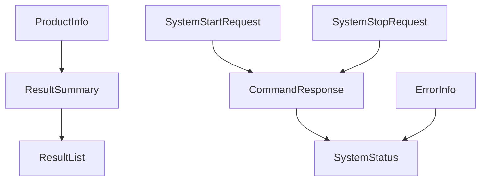

# 페이로드 참조

이 섹션에서는 공개 Virex.NET 통합 인터페이스에서 사용되는 JSON 페이로드 모델을 정의합니다.

각 모델에는 자체 페이지가 있습니다. 벤더는 `Virex.NET.Contracts`에서 C# 유형을 사용하거나 해당 언어로 동등한 모델을 정의할 수 있습니다. 통합 계약은 C# 유형 자체가 아니라 JSON 구조 및 동작입니다.

## JSON 규칙

| 규칙 | 동작 |
| --- | --- |
| 속성 이름 | `camelCase`를 사용하세요. |
| Null 값 | 직렬화할 때 생략됩니다. |
| 수신 속성 이름 | 대소문자를 구분하지 않습니다. |
| 텍스트 인코딩 | UTF-8 JSON. |

## 모델 그룹

| 그룹 | 모델 | 목적 |
| --- | --- | --- |
| 시스템 | [SystemStatus](payloads/system/system-status.ko.md), [ErrorInfo](payloads/system/error-info.ko.md) | 현재 시스템 상태 및 활성 오류 정보. |
| 제품 | [ProductInfo](payloads/product/product-info.ko.md) | 실행 및 결과와 관련된 제품 정보입니다. |
| 명령 | [CommandResponse](payloads/commands/command-response.ko.md), [SystemStartRequest](payloads/commands/system-start-request.ko.md), [SystemStopRequest](payloads/commands/system-stop-request.ko.md), [ControlRunModes](payloads/commands/control-run-modes.ko.md) | 명령 요청 및 명령 응답. |
| 결과 | [ResultSummary](payloads/results/result-summary.ko.md), [ResultList](payloads/results/result-list.ko.md) | 결과 요약 및 REST 결과 목록 래퍼. |

## 관계 요약

`Start`는 현재 `ProductInfo` 스냅샷을 캡처하고 `condition`를 보관합니다. 결과가 생성되면 두 값 모두 `ResultSummary`에 복사됩니다. REST 결과 쿼리는 `ResultList`를 반환합니다.

`SystemStatus`는 수명 주기 상태를 보고합니다. `ErrorInfo`는 다른 수명주기 상태가 아닌 독립적인 활성 오류 정보입니다.

## 통신 방식 매핑

| 데이터 모델 | REST | TCP | MQTT |
| --- | --- | --- | --- |
| SystemStatus | `GET /api/status` | `type: "statusChanged"` | `virex/statusChanged` |
| ProductInfo | `GET/POST /api/product-info` | 수신 `type: "productInfo"`; 송신 `type: "productInfoChanged"` | `virex/productInfoChanged` |
| CommandResponse | 시스템 명령 경로 응답 | 명령이 거부된 경우 `type: "commandRejected"` | `virex/commandRejected` |
| SystemStartRequest | `POST /api/system/start` 요청 | 수신 `type: "start"` | 사용되지 않음 |
| SystemStopRequest | `POST /api/system/stop` 요청 | 수신 `type: "stop"` | 사용되지 않음 |
| ResultSummary | `GET /api/results` 항목; 결과 생성 이벤트 | `type: "resultCreated"` | `virex/resultCreated` |
| ResultList | `GET /api/results` 응답 | 사용되지 않음 | 사용되지 않음 |
| ErrorInfo | 서비스별 오류 이벤트 | `type: "errorChanged"` | `virex/errorChanged` |
