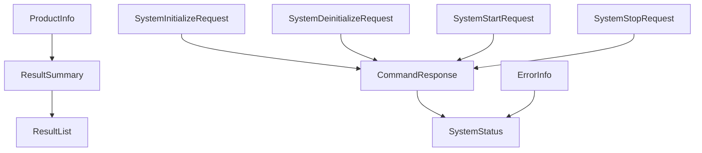

# Payload Reference

This section defines the JSON payload models used by the public Virex.NET integration interface.

Each model has its own page. Vendors can use the C# types in `Virex.NET.Contracts` or define equivalent models in their own language. The integration contract is the JSON structure and behavior, not the C# type itself.

## JSON rules

| Rule | Behavior |
| --- | --- |
| Property names | Use `camelCase`. |
| Null values | Omitted during serialization. |
| Incoming property names | Case-insensitive. |
| Text encoding | UTF-8 JSON. |

## Model Groups

| Group | Model | Purpose |
| --- | --- | --- |
| System | [SystemStatus](payloads/system/system-status.md), [ErrorInfo](payloads/system/error-info.md) | Current system state and active error information. |
| Product | [ProductInfo](payloads/product/product-info.md) | Product information associated with runs and results. |
| Commands | [CommandResponse](payloads/commands/command-response.md), [SystemInitializeRequest](payloads/commands/system-initialize-request.md), [SystemDeinitializeRequest](payloads/commands/system-deinitialize-request.md), [SystemStartRequest](payloads/commands/system-start-request.md), [SystemStopRequest](payloads/commands/system-stop-request.md), [ControlRunModes](payloads/commands/control-run-modes.md) | Command requests and command responses. |
| Results | [ResultSummary](payloads/results/result-summary.md), [ResultList](payloads/results/result-list.md) | Result summaries and the RESTful API result-list wrapper. |

## Relationship summary

`Start` captures the current `ProductInfo` snapshot and start `condition`. Both values are copied to `ResultSummary` when the result is produced. RESTful API result queries return `ResultList`.

`SystemStatus` reports the lifecycle state. `ErrorInfo` is independent active error information, not another lifecycle state.

## Transport Mapping

| Data Model | RESTful API | TCP | MQTT |
| --- | --- | --- | --- |
| SystemStatus | `GET /api/status` | `type: "statusChanged"` | `virex/statusChanged` |
| ProductInfo | `GET/POST /api/product-info` | Incoming `type: "productInfo"`; outgoing `type: "productInfoChanged"` | `virex/productInfoChanged` |
| CommandResponse | System command route response | `type: "commandRejected"` when a command is rejected | `virex/commandRejected` |
| SystemInitializeRequest | `POST /api/system/initialize` uses no request body | Incoming `type: "initialize"` | Not used |
| SystemDeinitializeRequest | `POST /api/system/deinitialize` uses no request body | Incoming `type: "deinitialize"` | Not used |
| SystemStartRequest | `POST /api/system/start` request | Incoming `type: "start"` | Not used |
| SystemStopRequest | `POST /api/system/stop` request | Incoming `type: "stop"` | Not used |
| ResultSummary | `GET /api/results` item; result-created event | `type: "resultCreated"` | `virex/resultCreated` |
| ResultList | `GET /api/results` response | Not used | Not used |
| ErrorInfo | Service-specific error events | `type: "errorChanged"` | `virex/errorChanged` |
