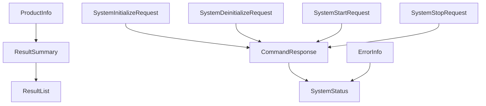

# 資料模型參考

這個章節定義公開 Virex.NET 整合介面使用的 JSON 資料模型。

每一個模型都有自己的頁面。廠商可以使用 `Virex.NET.Contracts` 裡的 C# 模型，也可以在自己的語言裡定義等價模型。整合合約是 JSON 結構與行為，不是 C# 型別本身。

## JSON 規則

| 規則 | 行為 |
| --- | --- |
| 屬性名稱 | 使用 `camelCase`。 |
| Null 值 | 序列化時省略。 |
| 傳入屬性名稱 | 不區分大小寫。 |
| 文字編碼 | UTF-8 JSON。 |

## 模型群組

| 群組 | 模型 | 用途 |
| --- | --- | --- |
| System | [SystemStatus](payloads/system/system-status.zh-Hant.md), [ErrorInfo](payloads/system/error-info.zh-Hant.md) | 目前系統狀態與作用中錯誤資訊。 |
| Product | [ProductInfo](payloads/product/product-info.zh-Hant.md) | 執行與結果關聯使用的產品資訊。 |
| Commands | [CommandResponse](payloads/commands/command-response.zh-Hant.md), [SystemInitializeRequest](payloads/commands/system-initialize-request.zh-Hant.md), [SystemDeinitializeRequest](payloads/commands/system-deinitialize-request.zh-Hant.md), [SystemStartRequest](payloads/commands/system-start-request.zh-Hant.md), [SystemStopRequest](payloads/commands/system-stop-request.zh-Hant.md), [ControlRunModes](payloads/commands/control-run-modes.zh-Hant.md) | 命令要求與回應資料。 |
| Results | [ResultSummary](payloads/results/result-summary.zh-Hant.md), [ResultList](payloads/results/result-list.zh-Hant.md) | 結果摘要資料與 REST 清單包裝。 |

## 關係摘要

`Start` 會保存目前的 `ProductInfo` 快照與開始 `condition`。產生結果時會把兩者複製到 `ResultSummary`。REST 結果查詢會回傳 `ResultList`。

`SystemStatus` 回報生命週期狀態。`ErrorInfo` 是獨立的作用中錯誤資訊，不是另一種生命週期狀態。

## 傳輸對照

| 資料模型 | REST | TCP | MQTT |
| --- | --- | --- | --- |
| SystemStatus | `GET /api/status` | `type: "statusChanged"` | `virex/statusChanged` |
| ProductInfo | `GET/POST /api/product-info` | 傳入 `type: "productInfo"`；傳出 `type: "productInfoChanged"` | `virex/productInfoChanged` |
| CommandResponse | 系統命令路由回應 | 拒絕命令時使用 `type: "commandRejected"` | `virex/commandRejected` |
| SystemInitializeRequest | `POST /api/system/initialize` 不使用 request body | 傳入 `type: "initialize"` | 不使用 |
| SystemDeinitializeRequest | `POST /api/system/deinitialize` 不使用 request body | 傳入 `type: "deinitialize"` | 不使用 |
| SystemStartRequest | `POST /api/system/start` 要求 | 傳入 `type: "start"` | 不使用 |
| SystemStopRequest | `POST /api/system/stop` 要求 | 傳入 `type: "stop"` | 不使用 |
| ResultSummary | `GET /api/results` 的項目；結果建立事件 | `type: "resultCreated"` | `virex/resultCreated` |
| ResultList | `GET /api/results` 回應 | 不使用 | 不使用 |
| ErrorInfo | 服務特定錯誤事件 | `type: "errorChanged"` | `virex/errorChanged` |
