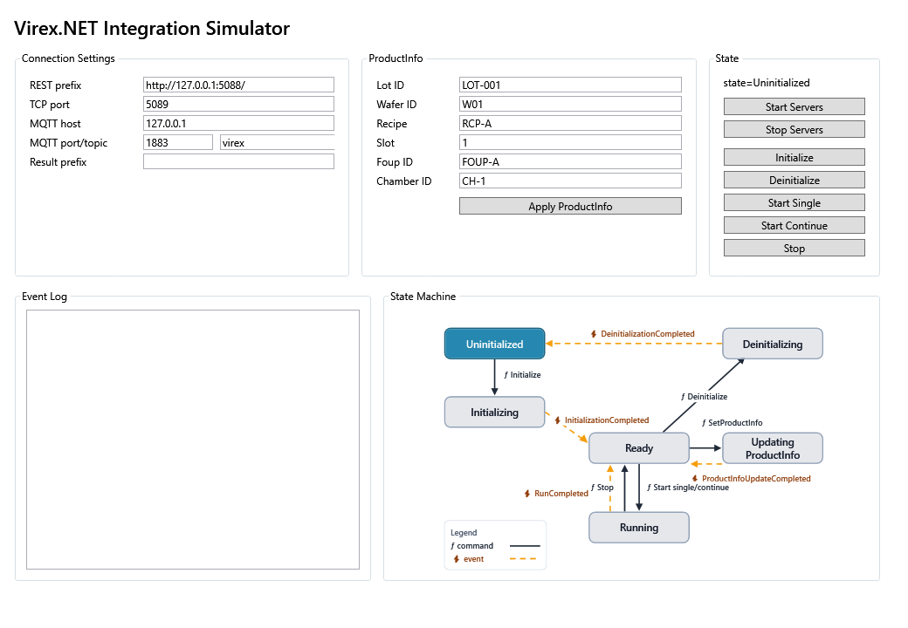

# 시뮬레이터 설명서

Virex.NET Integration Simulator는 고객 측 연동 개발을 위한 로컬 테스트 도구입니다. REST, TCP, MQTT 엔드포인트를 제공하며 WaferInfo, 상태 전이, 결과 요약, 오류 이벤트를 시뮬레이션할 수 있습니다.

저장소 루트에서 시작합니다.

```powershell
dotnet run --project src\Virex.NET.Simulator.WPF\Virex.NET.Simulator.WPF.csproj
```

## 목적

| 목적 | 검증 내용 |
| --- | --- |
| SDK 검증 | `VirexClient` 가 status 를 읽고, WaferInfo 를 제출하고, 사이클을 시작하고, 결과 요약을 조회할 수 있는지 확인합니다. |
| 원시 프로토콜 검증 | C# 이 아닌 시스템이 REST 페이로드, TCP/NDJSON 프레임, MQTT 토픽을 테스트할 수 있게 합니다. |
| 이벤트 시뮬레이션 | 프로덕션 호환 서비스에 연결하기 전에 status, wafer-info, result, error 이벤트를 로컬에서 발행합니다. |

## 앱 UI

아래 스크린샷은 안내형 샘플에서 사용하는 시뮬레이터 창을 보여 줍니다.

<figure>
  <div style="position: relative; width: 100%; max-width: 1008px; aspect-ratio: 1008 / 658;">
    
    <span aria-label="Area 1" style="position: absolute; left: 3%; top: 12%; width: 1.8rem; height: 1.8rem; border-radius: 999px; background: #1976d2; color: #fff; display: grid; place-items: center; font-weight: 700; font-size: 0.9rem; border: 2px solid #fff; box-shadow: 0 2px 6px rgba(0,0,0,0.3);">1</span>
    <span aria-label="Area 2" style="position: absolute; left: 42%; top: 12%; width: 1.8rem; height: 1.8rem; border-radius: 999px; background: #1976d2; color: #fff; display: grid; place-items: center; font-weight: 700; font-size: 0.9rem; border: 2px solid #fff; box-shadow: 0 2px 6px rgba(0,0,0,0.3);">2</span>
    <span aria-label="Area 3" style="position: absolute; left: 82%; top: 12%; width: 1.8rem; height: 1.8rem; border-radius: 999px; background: #1976d2; color: #fff; display: grid; place-items: center; font-weight: 700; font-size: 0.9rem; border: 2px solid #fff; box-shadow: 0 2px 6px rgba(0,0,0,0.3);">3</span>
    <span aria-label="Area 4" style="position: absolute; left: 4%; top: 58%; width: 1.8rem; height: 1.8rem; border-radius: 999px; background: #1976d2; color: #fff; display: grid; place-items: center; font-weight: 700; font-size: 0.9rem; border: 2px solid #fff; box-shadow: 0 2px 6px rgba(0,0,0,0.3);">4</span>
    <span aria-label="Area 5" style="position: absolute; left: 89%; top: 20%; width: 1.8rem; height: 1.8rem; border-radius: 999px; background: #1976d2; color: #fff; display: grid; place-items: center; font-weight: 700; font-size: 0.9rem; border: 2px solid #fff; box-shadow: 0 2px 6px rgba(0,0,0,0.3);">5</span>
    <span aria-label="Area 6" style="position: absolute; left: 60%; top: 32%; width: 1.8rem; height: 1.8rem; border-radius: 999px; background: #1976d2; color: #fff; display: grid; place-items: center; font-weight: 700; font-size: 0.9rem; border: 2px solid #fff; box-shadow: 0 2px 6px rgba(0,0,0,0.3);">6</span>
    <span aria-label="Area 7" style="position: absolute; left: 89%; top: 38%; width: 1.8rem; height: 1.8rem; border-radius: 999px; background: #1976d2; color: #fff; display: grid; place-items: center; font-weight: 700; font-size: 0.9rem; border: 2px solid #fff; box-shadow: 0 2px 6px rgba(0,0,0,0.3);">7</span>
    <span aria-label="Area 8" style="position: absolute; left: 89%; top: 47%; width: 1.8rem; height: 1.8rem; border-radius: 999px; background: #1976d2; color: #fff; display: grid; place-items: center; font-weight: 700; font-size: 0.9rem; border: 2px solid #fff; box-shadow: 0 2px 6px rgba(0,0,0,0.3);">8</span>
  </div>
  <figcaption>번호 표식은 아래 영역 표와 대응합니다.</figcaption>
</figure>

| 영역 | 이름 | 목적 |
| --- | --- | --- |
| 1 | Connection Settings | REST prefix, TCP 포트, MQTT 호스트/포트/토픽, result prefix. 테스트 전에 이 영역을 확인합니다. |
| 2 | WaferInfo | Lot ID, Wafer ID, Recipe ID, Slot, FOUP ID, Chamber ID. |
| 3 | State | 현재 `initialized`, `processState`, `recipe`, 주요 작업 버튼. |
| 4 | Event Log | 서버 시작, WaferInfo 업데이트, 사이클 이벤트, 결과, 오류 및 기타 활동. |
| 5 | **Start Servers** | 가장 먼저 누를 버튼입니다. 이 단계 후에만 REST/TCP/MQTT 서비스를 사용할 수 있습니다. |
| 6 | **Apply WaferInfo** | WaferInfo 필드를 편집한 뒤 현재 테스트 웨이퍼 컨텍스트를 적용합니다. |
| 7 | **Start Cycle** | 전체 사이클, 상태 전이, 결과 요약을 시뮬레이션합니다. |
| 8 | **Emit Fake Result** / **Emit Error** | 클라이언트 측 처리 테스트를 위해 결과 또는 오류 이벤트를 수동으로 발행합니다. |

## 표준 작업 절차

1. 시뮬레이터 앱을 시작합니다.

   ```powershell
   dotnet run --project src\Virex.NET.Simulator.WPF\Virex.NET.Simulator.WPF.csproj
   ```

2. 연결 설정을 확인합니다.

   처음 사용할 때는 기본값을 유지합니다.

   | 설정 | 기본값 |
   | --- | --- |
   | REST | `http://127.0.0.1:5088/` |
   | TCP | `5089` |
   | MQTT broker | `127.0.0.1:1883` |
   | MQTT topic | `virex` |

3. **Start Servers** 를 누릅니다.

   시작에 성공하면 REST listening, TCP listening, MQTT started/connected 기록이 Event Log 에 작성됩니다. SDK 와 샘플 클라이언트는 이 단계 후에만 연결할 수 있습니다.

   이 단계 직후 REST 검증 페이지를 사용할 수 있습니다.

   ```text
   Scalar:       http://127.0.0.1:5088/scalar
   OpenAPI JSON: http://127.0.0.1:5088/openapi/v1.json
   ```

   Scalar 를 사용하면 브라우저에서 status, wafer-info, control, results 엔드포인트를 호출할 수 있습니다.

4. 먼저 `not_initialized` 를 검증합니다.

   **Initialize** 를 누르기 전에 SDK 또는 REST 샘플을 실행합니다. 샘플이 start 를 호출하면 예상 반환값은 `HTTP 409 not_initialized` 입니다. 이는 샘플이 UI 상태를 올바르게 반영하고 있음을 의미합니다.

5. WaferInfo 를 입력하고 적용합니다.

   Lot ID, Wafer ID, Recipe ID, Slot, FOUP ID, Chamber ID 를 입력한 뒤 **Apply WaferInfo** 를 누르거나, 샘플이 WaferInfo 를 보내도록 합니다. Event Log 는 모든 필드를 한 줄에 나열해야 합니다.

   ```text
   WaferInfo updated from REST: lotId=LOT-RAW-REST-001, waferId=W01, recipeId=RCP-A, slot=1, foupId=FOUP-A, chamberId=CH-1
   ```

6. **Initialize** 와 **Start Cycle** 을 실행합니다.

   **Initialize** 를 눌러 초기화 상태로 설정합니다. 그런 다음 **Start Cycle** 을 누르거나 샘플이 계속 진행하게 합니다. 시뮬레이터는 `capturing`, `inspecting`, `saving` 을 거쳐 `ready` 로 돌아갑니다.

7. 테스트 이벤트를 발행합니다.

   결과 처리를 테스트하려면 **Emit Fake Result** 를 사용합니다. 오류 처리를 테스트하려면 **Emit Error** 를 사용합니다. MQTT 샘플이 실행 중일 때 이 버튼을 누르면 `virex/result` 와 `virex/error` 가 생성됩니다.

8. 테스트를 종료합니다.

   **Stop Servers** 를 누르거나 시뮬레이터 창을 닫습니다.

## 시나리오별 테스트 흐름

| 시나리오 | 조건 | UI 절차 | 예상 결과 |
| --- | --- | --- | --- |
| 통신 서비스 시작 | 시뮬레이터 앱이 열려 있고 서버는 시작되지 않음. | REST/TCP/MQTT 설정을 확인한 뒤 **Start Servers** 를 누름. | Event Log 에 REST listening, TCP listening, MQTT connected/started 가 표시되고 샘플이 연결할 수 있음. |
| `not_initialized` | **Start Servers** 는 눌렀지만 **Initialize** 는 누르지 않음. | **Initialize** 를 누르지 않음. C# SDK 또는 REST 샘플의 start 단계를 실행함. | 콘솔에 HTTP `409` / `not_initialized` 가 표시됨. 이는 예상된 상태 동작이며 연결 실패가 아님. |
| 정상 초기화와 사이클 | **Start Servers** 가 눌려 있고 상태는 `ready`. | **Initialize** 를 누르고 Status 가 `initialized=True` 인지 확인한 뒤 샘플 start 를 계속 진행함. | Status 가 `capturing`, `inspecting`, `saving`, `ready` 로 표시되고 Event Log 에 결과 발행이 표시됨. |
| WaferInfo 업데이트 검증 | **Start Servers** 가 눌려 있음. | UI 에서 **Apply WaferInfo** 를 누르거나 SDK/REST/TCP 샘플이 WaferInfo 를 보내도록 함. | Event Log 에 `lotId`, `waferId`, `recipeId`, `slot`, `foupId`, `chamberId` 가 한 줄로 나열됨. |
| MQTT 이벤트 관측 | MQTT 샘플이 `virex/#` 를 구독 중. | **Apply WaferInfo**, **Initialize**, **Start Cycle**, **Emit Fake Result**, **Emit Error** 를 누름. | 콘솔에 `wafer-info`, `status`, `result`, `error` 토픽이 표시됨. |
| 결과 조회 | **Start Cycle** 이 완료되었거나 **Emit Fake Result** 가 눌림. | SDK/REST 샘플을 사용해 현재 WaferInfo `lotId` 로 조회함. | 콘솔에 결과 개수가 출력됨. 0 이면 쿼리 필터가 WaferInfo 와 일치하는지 확인함. |

## 안내형 검증 시나리오

### 시나리오 A: 첫 SDK 연결 확인

1. 기본 연결 설정을 유지합니다.
2. **Start Servers** 를 누릅니다.
3. `samples/csharp-sdk` 를 실행합니다.
4. Event Log 에 WaferInfo, start, result 활동이 표시되는지 확인합니다.

### 시나리오 B: 수동 WaferInfo 테스트

1. 테스트 웨이퍼 컨텍스트를 입력합니다.
2. **Apply WaferInfo** 를 누릅니다.
3. **Initialize** 를 누릅니다.
4. **Start Cycle** 을 누르고 결과 요약을 기다립니다.

### 시나리오 C: 결과 이벤트 처리

1. **Start Servers** 를 누릅니다.
2. TCP 또는 MQTT 이벤트 리스너를 시작합니다.
3. **Emit Fake Result** 를 누릅니다.
4. 클라이언트가 결과 요약을 수신하고 Event Log 에 이벤트가 기록되는지 확인합니다.

### 시나리오 D: 오류 처리

1. **Start Servers** 를 누릅니다.
2. TCP 또는 MQTT 이벤트 리스너를 시작합니다.
3. **Emit Error** 를 누릅니다.
4. 클라이언트가 오류 메시지를 표시하거나 기록하는지 확인합니다.

## 클라이언트 검증

| 클라이언트 경로 | 명령 | 검증 |
| --- | --- | --- |
| SDK 샘플 | `dotnet run --project samples\csharp-sdk\CSharpSdkSample.csproj` | 표준 안내형 데모입니다. 먼저 `not_initialized` 를 확인한 뒤 **Initialize** 를 눌러 사이클과 결과 조회를 완료합니다. |
| Raw REST 샘플 | `dotnet run --project samples\csharp-raw-rest\CSharpRawRestSample.csproj` | REST status, WaferInfo, start, 결과 조회를 보여 줍니다. |
| Raw TCP 샘플 | `dotnet run --project samples\csharp-raw-tcp\CSharpRawTcpSample.csproj` | 초기 프레임과 WaferInfo 업데이트 이벤트를 확인합니다. |
| Raw MQTT 샘플 | `dotnet run --project samples\csharp-raw-mqtt\CSharpRawMqttSample.csproj` | UI 작업으로 발생하는 status, wafer-info, result, error 토픽을 확인합니다. |

## 문제 해결

| 증상 | 해결 방법 |
| --- | --- |
| **Start Servers** 실패 | REST prefix 또는 TCP 포트가 이미 사용 중인지, MQTT 브로커를 시작할 수 있는지 확인합니다. |
| SDK 연결 불가 | **Start Servers** 가 눌렸는지, SDK `RestBaseUrl`, TCP 호스트/포트, MQTT 호스트/포트/토픽이 UI 와 일치하는지 확인합니다. |
| `not_initialized` 표시 | **Initialize** 를 누르지 않았다면 예상된 상태입니다. **Initialize** 를 누르고 Status 를 확인한 뒤 샘플을 계속 진행합니다. |
| 이벤트 수신 없음 | 먼저 Event Log 에 발행된 이벤트가 있는지 확인한 뒤, 클라이언트가 TCP 또는 MQTT 로 구독/연결 중인지 확인합니다. |
| 결과 반환 없음 | 먼저 **Start Cycle** 또는 **Emit Fake Result** 를 실행한 뒤, 쿼리 필터가 현재 WaferInfo 와 일치하는지 확인합니다. |
