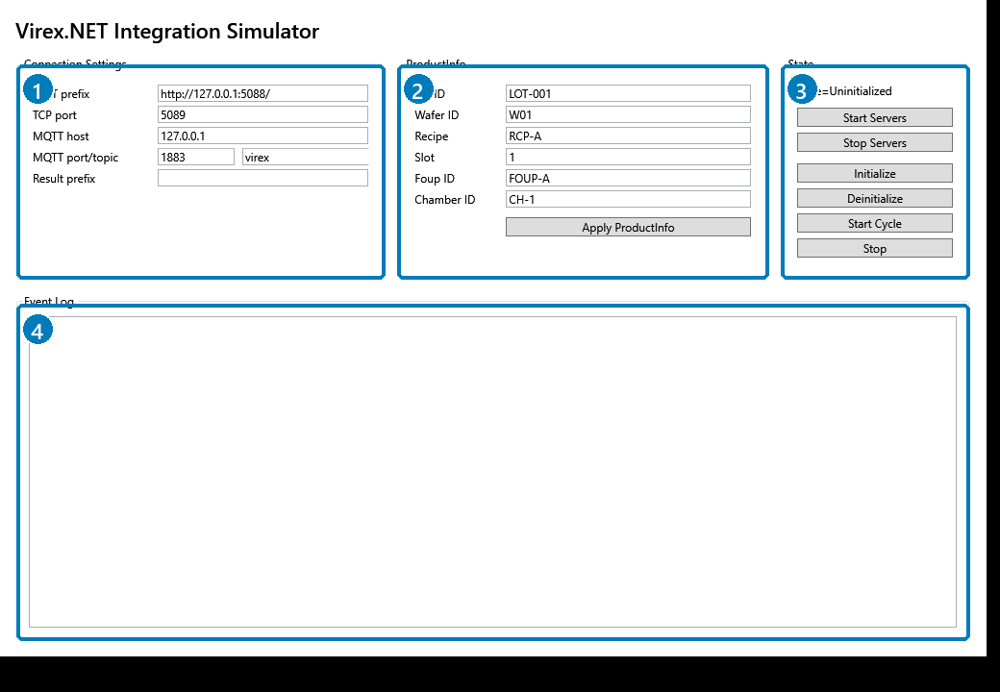

# 模擬器指南

`Virex.NET.Simulator.WPF` 是整合開發用的本機端點。從 RESTful API、TCP、MQTT、資料模型、狀態、事件的角度來看，它應該像一個與正式環境相容的 Virex.NET 服務。

從儲存庫根目錄啟動：

```powershell
dotnet run --project src\Virex.NET.Simulator.WPF\Virex.NET.Simulator.WPF.csproj
```

模擬器啟動後會顯示 WPF 視窗：



## 模擬器視窗導覽

| 區域 | 畫面區塊 | 用途 |
| --- | --- | --- |
| 1 | **Connection Settings** | 設定模擬器對外提供的端點。**RESTful API prefix** 是 HTTP 基底位址，**TCP port** 是 NDJSON socket 監聽埠，**MQTT host** 與 **MQTT port/topic** 是內建 MQTT broker 與 topic 前綴，**Result prefix** 只在測試結果 ID 或結果路徑需要前綴時使用。 |
| 2 | **ProductInfo** | 設定要送入模擬系統的產品脈絡。填入 Lot ID、Wafer ID、Recipe、Slot、Foup ID、Chamber ID，並在系統為 `Ready` 後按 **Apply ProductInfo**。 |
| 3 | **State** | 顯示目前模擬器狀態，並提供主要互動按鈕。**Start Servers** 會開啟 RESTful API、TCP、MQTT 端點。**Initialize**、**Deinitialize**、**Start Single**、**Start Continue**、**Stop** 會驅動與外部 RESTful API 用戶端相同的公開狀態轉換。 |
| 4 | **Event Log** | 顯示本機模擬器活動、伺服器啟停訊息、命令拒絕、產生的結果與其他診斷輸出。可用來確認按鈕操作或用戶端命令已送達模擬器。 |
| 5 | **State Machine** | 顯示即時狀態圖。高亮區塊會跟隨目前模擬器狀態。`ƒ` 標籤代表 command，`⚡` 標籤代表 event。`Initializing`、`UpdatingProductInfo`、`Deinitializing` 等中間狀態會短暫停留，方便檢查轉換路徑。 |

## 模擬器用途

| 目的 | 驗證項目 |
| --- | --- |
| 合約驗證 | 確認廠商程式使用與正式環境相同的 RESTful API 路由、資料模型、TCP 資料框、MQTT 主題。 |
| 狀態機驗證 | 確認命令順序、可接受狀態、拒絕狀態、執行完成行為。 |
| 事件驗證 | 確認 TCP/MQTT 消費端可處理狀態、ProductInfo、執行、結果、錯誤、拒絕事件。 |

模擬器不是正式檢測引擎，不暴露私有演算法、相機行為、recipe 內部邏輯或儲存內部邏輯。

## 標準操作

1. 啟動模擬器。
2. 確認端點設定。
3. 按 **Start Servers**。
4. 連接範例程式或廠商用戶端。
5. 初始化系統。
6. 送出 ProductInfo。
7. 按 **Start Single** 執行一次自動流程，或按 **Start Continue** 持續產生結果直到按 **Stop**。
8. 觀察 **State Machine** 高亮區塊如何跟著目前狀態移動。
9. 依 run mode 觀察 `runStarted`、`runCompleted`、`resultCreated`，或連續的 `resultCreated` 事件。
10. 查詢 `GET /api/results`。

## 預設端點

| 介面 | 預設值 |
| --- | --- |
| RESTful API | `http://127.0.0.1:5088` |
| RESTful API 瀏覽器 | `http://127.0.0.1:5088/scalar` |
| OpenAPI JSON | `http://127.0.0.1:5088/openapi/v1.json` |
| TCP | `127.0.0.1:5089` |
| MQTT | `127.0.0.1:1883`，topic 前綴 `virex` |

## 按鈕行為

| 按鈕 | 行為 |
| --- | --- |
| **Start Servers** | 啟動 RESTful API、TCP、MQTT 端點。不改變系統狀態。 |
| **Initialize** | 送出初始化命令。只在 `Uninitialized` 合法。 |
| **Deinitialize** | 送出反初始化命令。只在 `Ready` 合法。 |
| **Apply ProductInfo** | 更新目前 ProductInfo。只在 `Ready` 合法。 |
| **Start Single** | 以 `runMode=single` 啟動單次執行。只在 `Ready` 合法；回應狀態是 `Running`。模擬器會產生結果，並在 run-completed event 後回到 `Ready`。 |
| **Start Continue** | 以 `runMode=continue` 啟動連續執行。只在 `Ready` 合法；回應狀態是 `Running`。模擬器會持續產生結果，直到按 **Stop**。 |
| **Stop** | 停止執行中的流程。只在 `Running` 合法；回應狀態是 `Ready`。 |

## 可觀察行為

| 動作 | 預期外部觀察結果 |
| --- | --- |
| Initialize | RESTful API 命令回 `Ready`；發布狀態事件。 |
| ProductInfo 更新 | RESTful API 命令回 `Ready`；發布 ProductInfo 事件。 |
| Start single | RESTful API 命令回 `Running`；狀態切到 `Running`；發布結果建立事件；run-completed 會讓狀態回到 `Ready`。 |
| Start continue | RESTful API 命令回 `Running`；狀態維持 `Running`；持續發布結果建立事件，直到 stop 命令被接受。 |
| Stop | 狀態回到 `Ready`；continue mode 不需要額外的自動 run-completed event。 |
| 非法命令 | 命令回應包含 `accepted=false` 與 `errorCode=invalid_state`；可能發布拒絕事件。 |

## 建議的模擬器驗收流程

```powershell
dotnet test Virex.NET.Integration.slnx
python -m mkdocs build --strict
```

接著手動使用本機模擬器驗證已產生的文件與 C# SDK 範例。
