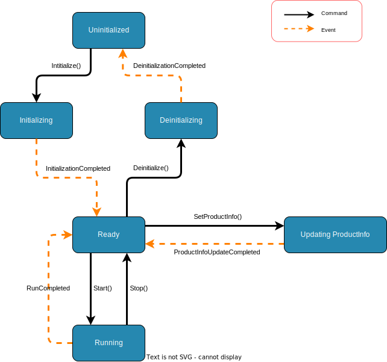

# 시스템 상태 머신

상태 머신은 각 시스템 수명주기 상태에서 유효한 명령을 정의합니다. 클라이언트는 명령을 보내기 전에 현재 상태를 사용하여 해당 명령이 허용되는지 여부를 결정해야 합니다.

## 상태

| 상태 | 의미 |
| --- | --- |
| `Uninitialized` | 초기화되지 않았습니다. 초기화 명령만 유효합니다. |
| `Initializing` | Initialize가 수락되었으며 시스템이 완료 이벤트를 기다리고 있습니다. |
| `Ready` | 대기 상태입니다. ProductInfo 업데이트, 시작 및 초기화 취소 명령이 유효합니다. |
| `UpdatingProductInfo` | ProductInfo 업데이트가 수락되었으며 시스템이 완료 이벤트를 기다리고 있습니다. |
| `Running` | 실행이 활성화되었습니다. 내부 실행 단계는 공개 상태가 아닙니다. |
| `Deinitializing` | Deinitialize가 수락되었으며 시스템이 완료 이벤트를 기다리고 있습니다. |

## 명령 및 이벤트

명령은 클라이언트나 운영자의 요청입니다. 시스템은 현재 상태에 유효한 경우에만 명령을 수락합니다.

이벤트는 시스템에 의해 생성된 결과입니다. 중간 상태를 완료하거나 장기 실행 작업이 종료되었음을 나타냅니다.

## 상태 전환

실선 전환은 명령을 나타냅니다. 점선 전환은 이벤트를 나타냅니다.

## 명령 유효성

| 명령 | 유효한 상태 | 수락 후 결과 |
| --- | --- | --- |
| `Initialize` | `Uninitialized` | `Initializing` 상태로 전환됩니다. `InitializationCompleted`는 상태를 `Ready`로 변경합니다. |
| `SetProductInfo` | `Ready` | `UpdatingProductInfo` 상태로 전환됩니다. `ProductInfoUpdateCompleted`는 상태를 `Ready`로 되돌립니다. |
| `Start` | `Ready` | 현재 ProductInfo 스냅샷을 캡처하고 `Running` 상태로 전환됩니다. |
| `Stop` | `Running` | 활성 실행을 중지하고 상태를 `Ready`로 반환합니다. |
| `Deinitialize` | `Ready` | `Deinitializing` 상태로 전환됩니다. `DeinitializationCompleted`는 상태를 `Uninitialized`로 변경합니다. |

## 거부된 명령

위 표에 나열되지 않은 상태에서 전송된 명령은 유효하지 않습니다. 잘못된 명령은 지속적으로 거부되어야 하며 현재 상태를 변경해서는 안 됩니다.

예를 들어 상태가 `Running`인 동안 `SetProductInfo`를 보내는 것은 유효하지 않습니다. 왜냐하면 ProductInfo는 상태가 `Ready`인 동안에만 변경할 수 있기 때문입니다.

## 결과 스냅샷

`Start`는 현재 `ProductInfo`를 즉시 캡처합니다. 생성된 결과는 해당 스냅샷을 사용합니다. 향후 구현에서 실행 중에 제품 정보가 변경되도록 허용하더라도 해당 변경 사항은 이미 시작된 실행의 결과에 영향을 주어서는 안 됩니다.

현재 상태 머신에서 `SetProductInfo`는 `Ready`에서만 유효하므로 `Running` 동안에는 ProductInfo를 변경할 수 없습니다.
