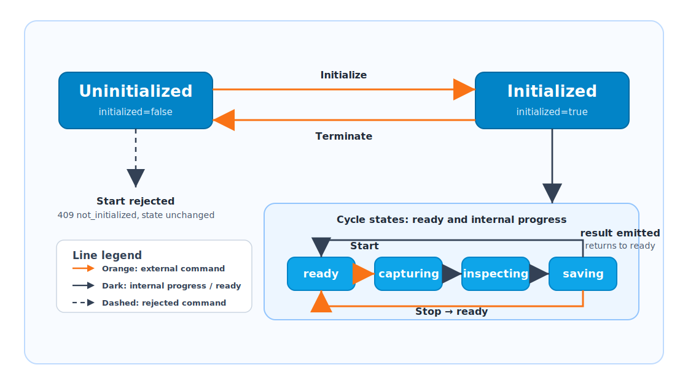

# 시작 순서와 상태 전이

이 페이지는 client가 simulator와 통합할 때 따라야 하는 시작 순서와 external commands로 인해 public state가 어떻게 변하는지 단순화된 state diagram으로 설명합니다. 다이어그램은 고객이 integration 판단에 필요한 상태만 유지하며 모든 내부 가능성을 나열하지 않습니다.

Simulator는 두 개의 public values로 상태를 보고합니다. Clients는 내부 구현 세부사항을 알 필요가 없으며, 다음 command가 유효한지 이 fields로 판단하면 됩니다.

| Field | Meaning |
| --- | --- |
| `initialized` | simulated service가 initialize 되었는지 여부입니다. |
| `processState` | 현재 process state입니다. `ready` 는 다음 cycle을 받을 수 있음을 의미합니다. `capturing`, `inspecting`, `saving` 은 cycle progress updates입니다. |

`Start Servers` 는 REST, TCP, MQTT endpoints가 listening 되는지만 제어합니다. `initialized` 또는 `processState` 는 변경하지 않습니다.

## State Diagram

다이어그램의 **external command** 는 client, SDK, REST 또는 TCP에서 보내는 control command를 의미합니다. `capturing`, `inspecting`, `saving` 은 cycle 중 simulator가 내부적으로 진행하는 progress states입니다. Clients는 일반적으로 status/result events를 기다리거나, 취소가 필요할 때 **Stop** 을 보냅니다.

## Client Rules

| Rule | Client-side check |
| --- | --- |
| **Start Servers** 는 communication prerequisite입니다. | REST/TCP/MQTT endpoints가 listening 된 후 연결합니다. |
| **Initialize** 는 cycle prerequisite입니다. | `initialized=false` 이면 start는 `409 not_initialized` 를 반환합니다. |
| **Start Cycle** 은 initialized 및 ready 상태에서만 보내야 합니다. | `initialized=true` 및 `processState=ready` 일 때 start가 허용됩니다. |
| Active cycle states는 progress updates입니다. | `capturing`, `inspecting`, `saving` 은 cycle이 실행 중임을 의미합니다. status/result events를 기다리거나 stop을 보냅니다. |
| Simulator는 result event 후 ready로 돌아갑니다. | Result summary 후 `processState=ready` 가 되고 다음 cycle을 시작할 수 있습니다. |

## Commands And Transitions

| Command or UI action | Required state | Result |
| --- | --- | --- |
| **Initialize** / `POST /api/control/initialize` | `initialized=false`, `processState=ready` | `initialized=true` 로 설정하고 `processState=ready` 를 유지합니다. |
| **Terminate** / `POST /api/control/terminate` | `processState=ready` | `initialized=false` 로 설정하고 `processState=ready` 를 유지합니다. |
| **Start Cycle** / `POST /api/control/start` / TCP `{"type":"start"}` | `initialized=true`, `processState=ready` | `capturing`, `inspecting`, `saving` 순서로 전이한 뒤 result emission 후 `ready` 로 돌아갑니다. |
| **Stop** / `POST /api/control/stop` / TCP `{"type":"stop"}` | Active process state: `capturing`, `inspecting`, or `saving` | 현재 cycle을 cancel하고 `ready` 로 돌아갑니다. |
| **Apply WaferInfo** / WaferInfo REST or TCP update | Any process state | wafer context를 업데이트하고 wafer-info events를 보냅니다. `processState` 는 변경하지 않습니다. |
| **Emit Fake Result** | Any process state | 단일 result summary event를 보냅니다. `processState` 는 변경하지 않습니다. |
| **Emit Error** | Any process state | error event를 보냅니다. `processState` 는 변경하지 않습니다. |

## Common Rejected Commands

| Condition | Command | Response |
| --- | --- | --- |
| `initialized=false` | Start cycle | HTTP `409` / `not_initialized`; state는 `initialized=false`, `processState=ready` 로 유지됩니다. |
| `processState` is `capturing`, `inspecting`, or `saving` | Start cycle | HTTP `409` / `process_active`; 현재 cycle은 계속됩니다. |
| `initialized=false` | Stop | HTTP `409` / `not_initialized`; state는 변경되지 않습니다. |
| `initialized=true`, `processState=ready` | Stop | HTTP `409` / `not_running`; state는 변경되지 않습니다. |
| `processState` is not `ready` | Terminate | HTTP `409`; state는 변경되지 않습니다. |

## Event Visibility

State changes는 다음 방법으로 확인할 수 있습니다.

- REST `GET /api/status`
- TCP `status` events
- MQTT `virex/status` events
- SDK `GetStatusAsync`

Result, wafer-info, error events는 별도의 event types입니다. Simulator가 `ready` 일 때 발생할 수 있지만, 추가 `processState` values는 아닙니다.
