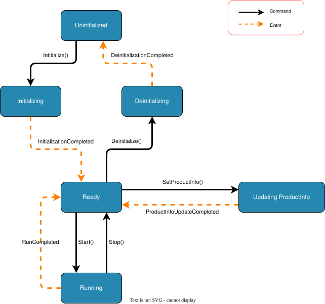

# System State Machine

The state machine defines which commands are valid in each system lifecycle state. Before a client sends a command, it should use the current state to decide whether that command is allowed.

## States

| State | Meaning |
| --- | --- |
| `Uninitialized` | Not initialized. Only the initialize command is valid. |
| `Initializing` | Initialize has been accepted and the system is waiting for the completion event. |
| `Ready` | Idle. ProductInfo update, start, and deinitialize commands are valid. |
| `UpdatingProductInfo` | ProductInfo update has been accepted and the system is waiting for the completion event. |
| `Running` | A run is active. Internal run phases are not public states. |
| `Deinitializing` | Deinitialize is running or is a retryable recovery action; the client must keep Deinitialize available until cleanup completes. |

## Commands and events

A command is a request from a client or operator. The system accepts a command only when it is valid for the current state.

Events are outcomes generated by the system. They complete intermediate states or indicate that a long-running action has ended.

## State Transitions

Solid transitions represent commands. Dashed transitions represent events.

## Command Validity

| Command | Valid State | Result After Acceptance |
| --- | --- | --- |
| `Initialize` | `Uninitialized` | Enters `Initializing`; `InitializationCompleted` changes the state to `Ready`. |
| `SetProductInfo` | `Ready` | Enters `UpdatingProductInfo`; `ProductInfoUpdateCompleted` returns the state to `Ready`. |
| `Start` | `Ready` | Captures the current ProductInfo snapshot and enters `Running`. |
| `Stop` | `Running` | Stops the active run and returns the state to `Ready`. |
| `Deinitialize` | `Ready` or `Deinitializing` (recovery retry) | Enters or remains in `Deinitializing`; successful completion changes the state to `Uninitialized`. |

## Rejected Commands

Any command sent from a state not listed in the table above is invalid. Invalid commands must be rejected consistently and must not change the current state.

For example, sending `SetProductInfo` while the state is `Running` is invalid because ProductInfo can only be changed while the state is `Ready`.

## Recovery contract

When an internal acquisition fault makes the current sources untrusted, `Faulted` must not be exposed to clients.
The public projection remains `Deinitializing` and `CommandResponse`, `SystemStatus`, or `ErrorInfo` carries
`recoveryAction: "Deinitialize"`. Clients must keep Deinitialize actionable and may retry it when the first automatic
deinitialization attempt fails. Restarting the app is the last resort only after Deinitialize retries cannot complete.

## Result snapshot

`Start` immediately captures the current `ProductInfo`. Generated results use that snapshot. Even if a future implementation allows product information to change during a run, that change must not affect results for a run that has already started.

In the current state machine, `SetProductInfo` is valid only in `Ready`, so ProductInfo cannot be changed while `Running`.
