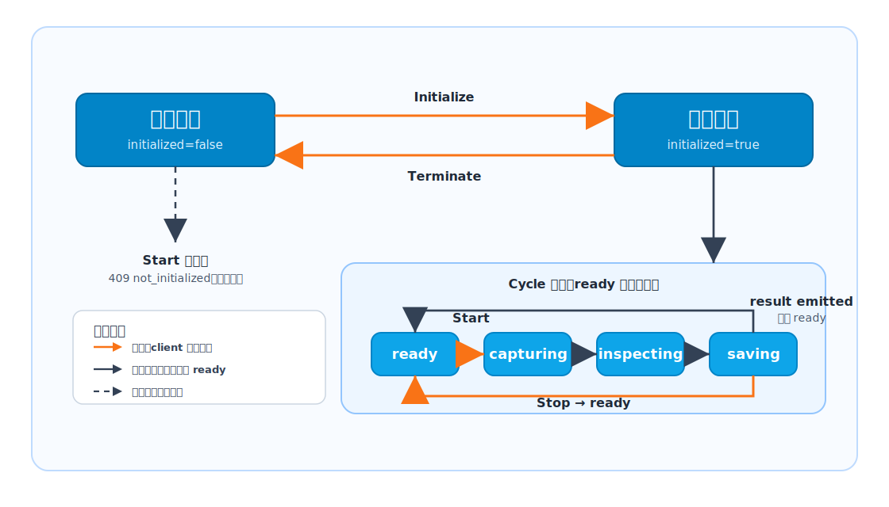

# 啟動順序與狀態轉移

本頁用簡化狀態圖說明 client 與 simulator 整合時的啟動順序，以及外部 command 會造成的公開狀態變化。圖中只保留客戶整合時需要判斷的狀態，不列出所有內部可能狀態。

Simulator 使用兩個公開值回報狀態；client 不需要知道內部實作細節，只要依照這兩個欄位判斷下一步是否可執行。

| Field | 意義 |
| --- | --- |
| `initialized` | 模擬服務是否已 initialize。 |
| `processState` | 目前 process 狀態。`ready` 代表可接受下一個 cycle；`capturing`、`inspecting`、`saving` 是 cycle 進度回報。 |

`Start Servers` 只控制 REST、TCP、MQTT endpoints 是否開始 listening，不會改變 `initialized` 或 `processState`。

## 狀態示意圖

圖中的 **external command** 是 client、SDK、REST 或 TCP 送出的控制指令。`capturing`、`inspecting`、`saving` 是 simulator 在 cycle 內部自行推進後對外回報的進度狀態；client 通常只需要等待 status/result events，或在需要中止時送出 **Stop**。

## Client 應記住的規則

| 規則 | Client 端判斷方式 |
| --- | --- |
| **Start Servers** 是通訊前置條件 | REST/TCP/MQTT endpoints listening 後，client 才能連線。 |
| **Initialize** 是 cycle 前置條件 | `initialized=false` 時，start 會回 `409 not_initialized`。 |
| **Start Cycle** 只應在 ready 且 initialized 後送出 | `initialized=true` 且 `processState=ready` 時，start 才會進入 cycle。 |
| Cycle 中的狀態是進度回報 | `capturing`、`inspecting`、`saving` 表示目前 cycle 正在進行，client 應等待 status/result event 或送 stop。 |
| Result event 後回到 ready | 收到 result summary 後，狀態會回到 `processState=ready`，可開始下一個 cycle。 |

## Commands 與 transitions

| Command 或 UI action | Required state | Result |
| --- | --- | --- |
| **Initialize** / `POST /api/control/initialize` | `initialized=false`、`processState=ready` | 設為 `initialized=true`，`processState` 維持 `ready`。 |
| **Terminate** / `POST /api/control/terminate` | `processState=ready` | 設為 `initialized=false`，`processState` 維持 `ready`。 |
| **Start Cycle** / `POST /api/control/start` / TCP `{"type":"start"}` | `initialized=true`、`processState=ready` | 依序進入 `capturing`、`inspecting`、`saving`，產生 result 後回到 `ready`。 |
| **Stop** / `POST /api/control/stop` / TCP `{"type":"stop"}` | Active process state：`capturing`、`inspecting` 或 `saving` | 取消目前 cycle 並回到 `ready`。 |
| **Apply WaferInfo** / WaferInfo REST 或 TCP update | 任一 process state | 更新 wafer context 並送出 wafer-info events。不改變 `processState`。 |
| **Emit Fake Result** | 任一 process state | 送出單筆 result summary event。不改變 `processState`。 |
| **Emit Error** | 任一 process state | 送出 error event。不改變 `processState`。 |

## 常見 rejected commands

| Condition | Command | Response |
| --- | --- | --- |
| `initialized=false` | Start cycle | HTTP `409` / `not_initialized`；state 維持 `initialized=false`、`processState=ready`。 |
| `processState` 是 `capturing`、`inspecting` 或 `saving` | Start cycle | HTTP `409` / `process_active`；目前 cycle 繼續。 |
| `initialized=false` | Stop | HTTP `409` / `not_initialized`；state 不變。 |
| `initialized=true`、`processState=ready` | Stop | HTTP `409` / `not_running`；state 不變。 |
| `processState` 不是 `ready` | Terminate | HTTP `409`；state 不變。 |

## Event visibility

State changes 可透過以下方式觀察：

- REST `GET /api/status`
- TCP `status` events
- MQTT `virex/status` events
- SDK `GetStatusAsync`

Result、wafer-info 與 error events 是獨立 event types。它們可能在 simulator 為 `ready` 時發生，但不是額外的 `processState` 值。
